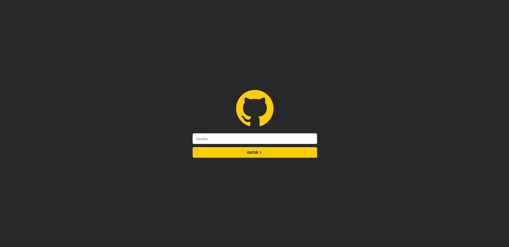
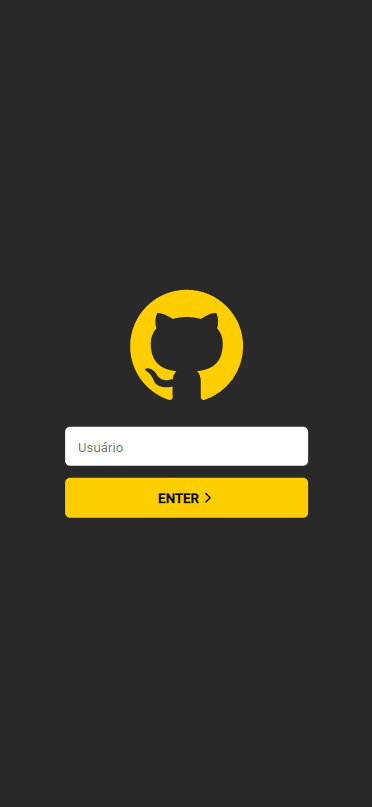

<h1 align="center">
  GITHUB PROFILE
</h1>

<h2 align="center">ReactJS Challenge</h2>

## ❓ How to use?

### Installation

```bash
$ cd react-challenge
$ npm install
$ npm run dev
```

### Run

```bash
$ cd react-challenge
$ npm run dev
```

## 💻 Web View

<h1 align="center">
  
</h1>

## 📱 Mobile View

<h1 align="center">
  
</h1>

<br>

<p align="center">
  Created by Bruno Lemos.
</p>
